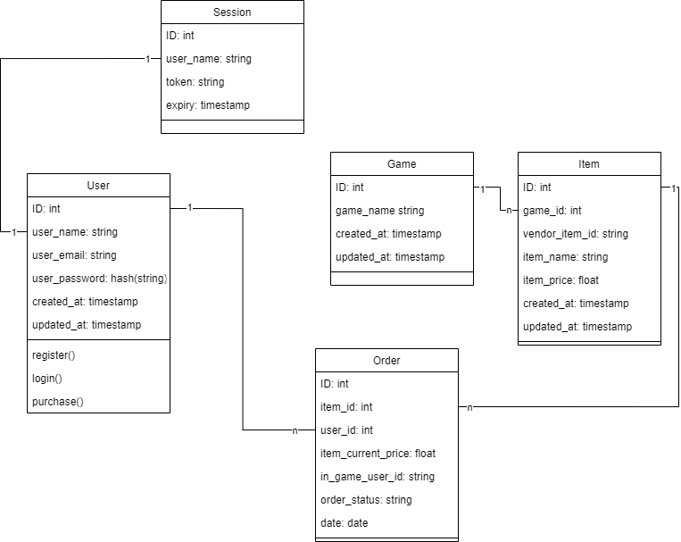

<a id="readme-top"></a>
<div align="center">
    <a href="https://github.com/rzqmhb/top-up-center">
        
    </a>
    <h3 align="center">Game Top Up Center</h3>
    <p align="center">
        A Website built using the Gin Gonic framework aimed at providing a convenient solution for topping up popular in-game currencies.
    </p>
</div>

<br>
<details>
    <summary>Table of Contents</summary>
    <ol>
        <li>
            <a href="#about-the-project" style="color: black;">About The Project</a>
            <ul>
                <li><a href="#built-with" style="color: black;">Built With</a></li>
            </ul>
        </li>
        <li><a href="#roadmap" style="color: black;">Roadmap</a></li>
        <li><a href="#getting-started" style="color: black;">Getting Started</a></li>
    </ol>
</details>


## About The Project

This is a personal project created to showcase the knowledge and skills I have acquired over the past three years, encompassing five semesters studying Informatics Engineering at Politeknik Negeri Malang, as well as one semester dedicated to software development using Go during Ruangguru's bootcamp.

<p align="right">(<a href="#readme-top" style="color: black;">back to top</a>)</p>

### Built With

* ![Go]
* ![Gin]


## Roadmap

- System Design
  - [x] Class Diagram
        
  - [ ] ~~Use Case Diagram~~ (after giving it some thought, this project only require simple some usecases, so a usecase diagram isnt needed.)
- System Architecture
  - [ ] Designed initial system architecture incorporating Gin Gonic framework.
  - [ ] Integrated PostgreSQL as the primary database.
  - [ ] Explore Redis integration for caching and session management.
- Development Progress
  - [x] Setup project structure and version control using Git.
- Documentation
  - [x] Started README.md file outlining project goals

<p align="right">(<a href="#readme-top" style="color: black;">back to top</a>)</p>

## Getting Started

To migrate the database tables, run these commands with their corresponding parameters:
1. Cleaning up the database, making sure the soon to be migrated tables did not exists in the database<br/> ```migrate -database postgres://<user>:<password>@<host>:<port>/<db_name>?sslmode=disable -path database/migrations down```
<br/>

2. Migrating the tables <br/> ```migrate -database postgres://<user>:<password>@<host>:<port>/<db_name>?sslmode=disable -path database/migrations up```

<p align="right">(<a href="#readme-top" style="color: black;">back to top</a>)</p>

[Go]: https://badgen.net/badge/Go/v1.21.6?icon=https://go.dev/blog/go-brand/Go-Logo/SVG/Go-Logo_Aqua.svg
[Gin]: https://badgen.net/badge/Gin%20Gonic/v1.10.0?icon=https://raw.githubusercontent.com/gin-gonic/logo/master/color.svg