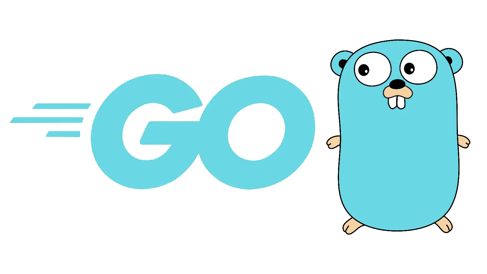

    
    <h3 align="center">Game Top Up Center</h3>
    

        A Website built using the Gin Gonic framework aimed at providing a convenient solution for topping up popular in-game currencies.
    

 

    
Table of Contents

    <ol>
        <li>
            <a href="#about-the-project" style="color: black;">About The Project</a>
            <ul>
                <li><a href="#built-with" style="color: black;">Built With</a></li>
            </ul>
        </li>
        <li><a href="#roadmap" style="color: black;">Roadmap</a></li>
    </ol>

## About The Project

This is a personal project made with sole purpose of showcasing what I have learned for the past 3 years, 5 semesters studying Informatic Engineering field in Politeknik Negeri Malang and 1 semester spend studying software development utilizing Go at Ruanggurus's bootcamp.

(<a href="#readme-top" style="color: black;">back to top</a>)

### Built With

* ![Go]
* ![Gin]

## Roadmap

- System Design
  - [ ] Class Diagram
  - [ ] Use Case Diagram
- System Architecture
  - [ ] Designed initial system architecture incorporating Gin Gonic framework.
  - [ ] Integrated PostgreSQL as the primary database.
  - [ ] Explore Redis integration for caching and session management.
- Development Progress
  - [x] Setup project structure and version control using Git.
- Documentation
  - [x] Started README.md file outlining project goals

(<a href="#readme-top" style="color: black;">back to top</a>)

[Go]: https://badgen.net/badge/Go/v1.21.6?icon=https://go.dev/blog/go-brand/Go-Logo/SVG/Go-Logo_Aqua.svg
[Gin]: https://badgen.net/badge/Gin%20Gonic/v1.10.0?icon=https://raw.githubusercontent.com/gin-gonic/logo/master/color.svg